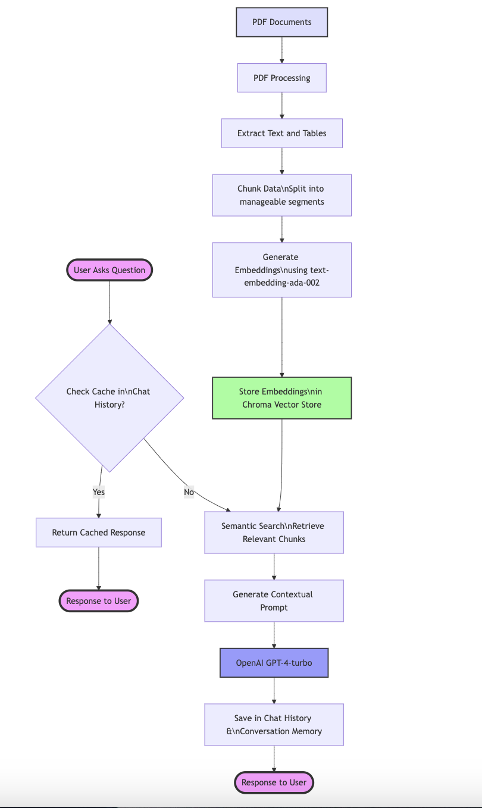

# Syllabus Field Detector

## Project Overview

The **Syllabus Field Detector** is a web application that automatically analyzes academic syllabi to extract and validate 19 different course information fields. Built for university administrators, department chairs, and academic compliance teams, the system helps ensure syllabi meet institutional standards and accreditation requirements.

**Who It Serves:**
- **Academic Departments** — Verify syllabus compliance with accreditation standards (e.g., presence of Student Learning Outcomes)
- **Instructors** — Quickly check if their syllabi contain all required information
- **Institutional Research** — Extract standardized course data for databases and reporting
- **Quality Assurance Teams** — Batch-process syllabi to identify missing or incomplete fields

**Key Features:**
- Detects 19 fields including SLOs, instructor info, grading policies, and course modality
- Uses lightweight pattern matching—no AI/LLM required
- Provides instant, explainable results with confidence scores
- Supports batch processing via ZIP uploads or folder selection
- Achieves **91.6% F1 Score** across all detectors (tested on 161 syllabi)

**Confluence Space:** [Team Alpha Documentation](https://alpha-egaa.atlassian.net/wiki/x/AYADAw)

---

## File and Folder Organization

```
Fall2025-Team-Alpha/
│
├── main.py                     # Application entry point - starts Flask server
├── config.py                   # Server configuration (host, port, logging)
├── api_routes.py               # HTTP request handlers, orchestrates all detectors
├── document_processing.py      # PDF/DOCX text extraction engine
│
├── detectors/                  # 19 specialized field detection modules
│   ├── __init__.py
│   ├── slo_detector.py                  # Student Learning Outcomes
│   ├── online_detection.py              # Course modality (Online/Hybrid/In-Person)
│   ├── instructor_detector.py           # Instructor name, title, department
│   ├── email_detector.py                # Instructor email address
│   ├── office_information_detection.py  # Office location, hours, phone
│   ├── credit_hours_detection.py        # Credit hours
│   ├── workload_detection.py            # Expected study hours
│   ├── grading_scale_detection.py       # Letter grade scale (A-F)
│   ├── grading_process_detection.py     # Grading procedures/policies
│   ├── assignment_types_detection.py    # Assignment categories
│   ├── assignment_delivery_detection.py # Submission platforms (Canvas, etc.)
│   ├── late_missing_work_detector.py    # Late work policies
│   ├── response_time_detector.py        # Email response time commitments
│   ├── class_location_detector.py       # Physical class locations
│   └── preferred_contact_detector.py    # Preferred contact method
│
├── templates/
│   └── index.html              # Web UI with drag-and-drop file upload
│
├── static/
│   ├── architecture.png        # System architecture diagram
│   ├── logo3.png              # Application logo
│   └── favicon.ico            # Browser favicon
│
├── ground_truth_syllabus/      # Test syllabi (PDF/DOCX files)
├── ground_truth.json           # Expected values for each test syllabus
├── test_runner.py              # Automated testing framework
├── test_results.json           # Latest test metrics output
│
├── requirements.txt            # Python dependencies
├── Dockerfile                  # Container configuration
├── DockerREADME.md            # Docker deployment guide
├── DEVELOPER_GUIDE.md         # How to add new detectors
└── README.md                   # This file
```

---

## System Architecture



### High-Level Design

The application follows a modular pipeline architecture:

```
┌─────────────┐     ┌──────────────────┐     ┌─────────────────┐     ┌────────────┐
│   Web UI    │────▶│  Flask Server    │────▶│   Document      │────▶│  Detector  │
│ (index.html)│     │  (api_routes.py) │     │   Processing    │     │   Engine   │
└─────────────┘     └──────────────────┘     └─────────────────┘     └────────────┘
                                                     │                      │
                                                     ▼                      ▼
                                              ┌─────────────┐      ┌──────────────┐
                                              │ PDF/DOCX    │      │ 19 Detectors │
                                              │ Extraction  │      │ (parallel)   │
                                              └─────────────┘      └──────────────┘
```

### Key Components

| Component | File | Responsibility |
|-----------|------|----------------|
| **Entry Point** | `main.py` | Starts Flask server on port 8001 |
| **Configuration** | `config.py` | Logging level, host, port, debug settings |
| **API Layer** | `api_routes.py` | Handles uploads, orchestrates detectors, returns JSON |
| **Text Extraction** | `document_processing.py` | Extracts text from PDF (pdfplumber) and DOCX (python-docx) |
| **Detectors** | `detectors/*.py` | 19 independent modules, each detecting one field |
| **Frontend** | `templates/index.html` | Drag-and-drop interface, displays results |

### Data Flow

1. **Upload** — User uploads PDF/DOCX/ZIP via web interface
2. **Extract** — `document_processing.py` extracts text and tables from document
3. **Detect** — Text is passed to all 19 detectors in parallel
4. **Respond** — Each detector returns `{field_name, found, content, confidence}`
5. **Display** — Results rendered in UI with FOUND/MISSING status and evidence

### Detector Pattern

Each detector is an independent module following this interface:

```python
class XxxDetector:
    def detect(self, text: str) -> dict:
        return {
            'field_name': 'xxx',
            'found': True/False,
            'content': 'extracted value' or 'Missing',
            'confidence': 0.0-1.0  # optional
        }
```

---

## Data Model

This application does not use a database. All data is processed in-memory and results are returned directly to the user.

### Ground Truth Schema (for testing)

The `ground_truth.json` file stores expected values for test syllabi:

```json
{
  "file_name": "Example_Syllabus.pdf",
  "modality": "Online",
  "SLOs": true,
  "email": "professor@unh.edu",
  "credit_hour": "3",
  "workload": "9 hours per week",
  "instructor_name": "Dr. Jane Smith",
  "instructor_title": "Associate Professor",
  "instructor_department": "Computer Science",
  "office_address": "Kingsbury Hall N229",
  "office_hours": "MWF 2-4pm",
  "office_phone": "(603) 862-1234",
  "preferred_contact_method": "Email",
  "assignment_types_title": true,
  "deadline_expectations_title": true,
  "assignment_delivery": "Canvas",
  "final_grade_scale": true,
  "response_time": "24 hours",
  "class_location": "Room 204",
  "grading_process": true
}
```

---

## Installation and Deployment Instructions

### Local Development Setup

**Prerequisites:**
- Python 3.8 or higher
- pip (Python package manager)

**Step-by-step:**

```bash
# 1. Clone the repository
git clone https://github.com/UNHM-TEAM-PROJECT/Fall2025-Team-Alpha.git
cd Fall2025-Team-Alpha

# 2. Create virtual environment (recommended)
python -m venv venv
source venv/bin/activate  # On Windows: venv\Scripts\activate

# 3. Install dependencies
pip install -r requirements.txt

# 4. Run the application
python main.py

# 5. Open browser to http://localhost:8001
```

**Dependencies:**
- `flask==3.0.3` — Web framework
- `pdfplumber==0.11.4` — PDF text extraction
- `python-docx==1.1.0` — Word document processing
- `python-dotenv==1.0.1` — Environment configuration
- `lxml>=4.9.0` — XML parsing for DOCX

### Production Deployment (Docker on VM)

**Prerequisites:**
- SSH access to the VM (whitemount.sr.unh.edu)
- Docker installed on VM

**Step-by-step:**

```bash
# 1. SSH into the VM
ssh username@whitemount.sr.unh.edu

# 2. Clone the repository
git clone git@github.com:UNHM-TEAM-PROJECT/Fall2025-Team-Alpha.git
cd Fall2025-Team-Alpha

# 3. Build Docker image
docker build -t syllabus-checker .

# 4. Run container
docker run -p 8001:8001 syllabus-checker

# OR run in background (persists after logout):
nohup docker run -p 8001:8001 syllabus-checker > runtime.log 2>&1 &

# 5. Access at https://whitemount-t1.sr.unh.edu
```

**Useful Docker Commands:**
```bash
docker ps                    # List running containers
docker stop <container_id>   # Stop a container
docker logs <container_id>   # View container logs
docker images                # List built images
```

See `DockerREADME.md` for detailed deployment instructions including SSH key setup for 2FA.

### Configuration

| Setting | Location | Default | Description |
|---------|----------|---------|-------------|
| Host | `config.py` | `0.0.0.0` | Server bind address |
| Port | `config.py` | `8001` | Server port |
| Debug | `config.py` | `True` | Flask debug mode |
| Log Level | `config.py` | `INFO` | Logging verbosity |

**No API keys or external services required.** The application runs entirely offline using pattern matching.

---

## Usage Guide

### Web Interface

1. **Open the application** at `http://localhost:8001` (local) or `https://whitemount-t1.sr.unh.edu` (production)

2. **Upload a syllabus:**
   - Drag and drop a file onto the upload area, OR
   - Click to browse and select a file
   - Supported formats: PDF, DOCX, ZIP (for batch)

3. **View results:**
   - **SLO Status** — PASS (green) or FAIL (red) with preview of detected SLOs
   - **Modality Badge** — Online, In-Person, or Hybrid with confidence score
   - **Field Cards** — Each detected field shows FOUND/MISSING status with extracted content

4. **Batch processing:**
   - Upload a ZIP file containing multiple syllabi
   - Results are displayed for each file in the archive

### Running Tests

```bash
# Run automated tests against ground truth
python test_runner.py

# Results saved to test_results.json
```

### Current Test Results (161 syllabi)

| Field | Accuracy | Precision | Recall | F1 Score |
|-------|----------|-----------|--------|----------|
| response_time | 98.1% | 96.8% | 93.8% | 95.2% |
| instructor_name | 94.4% | 100.0% | 94.2% | 97.0% |
| instructor_title | 95.0% | 92.1% | 97.2% | 94.6% |
| assignment_delivery | 90.7% | 98.5% | 91.0% | 94.6% |
| grading_process | 89.3% | 97.2% | 91.5% | 94.3% |
| email | 89.4% | 97.1% | 91.3% | 94.1% |
| preferred_contact_method | 88.2% | 95.8% | 91.3% | 93.5% |
| credit_hour | 89.4% | 100.0% | 85.1% | 91.9% |
| office_address | 91.9% | 98.7% | 86.1% | 91.9% |
| office_phone | 92.5% | 95.2% | 87.0% | 90.9% |
| office_hours | 86.3% | 99.1% | 83.9% | 90.8% |
| workload | 90.1% | 91.8% | 89.7% | 90.7% |
| class_location | 84.5% | 98.3% | 83.6% | 90.3% |
| instructor_department | 90.7% | 89.5% | 90.7% | 90.1% |
| final_grade_scale | 93.8% | 95.6% | 84.3% | 89.6% |
| SLOs | 91.3% | 100.0% | 79.4% | 88.5% |
| modality | 77.0% | 96.1% | 79.5% | 87.0% |
| deadline_expectations_title | 80.1% | 98.1% | 77.1% | 86.3% |
| assignment_types_title | 80.1% | 91.7% | 81.3% | 86.2% |
| **OVERALL** | **89.1%** | **96.6%** | **87.0%** | **91.6%** |

---

## Next Steps and Future Work

### Technical Debt

1. **Scanned PDF Support** — Current system cannot extract text from image-based/scanned PDFs. Consider integrating OCR (e.g., Tesseract) for these cases.

2. **Edge Case Handling** — Some syllabi use non-standard formatting that causes detection failures. The detectors could be improved to handle more variations.

3. **Test Coverage** — Unit tests exist for some detectors but not all. Expanding test coverage would improve reliability.

### Recommended Improvements for Future Teams

1. **Improve F1 Scores** — Focus on improving recall for lower-performing detectors:
   - `modality` (77.0% accuracy) — Add more pattern variations for hybrid courses
   - `deadline_expectations_title` (80.1%) — Handle more section title variations
   - `assignment_types_title` (80.1%) — Expand pattern matching

2. **Solve Edge Cases** — Analyze false negatives in `test_results.json` to identify common failure patterns and add handling for them.

3. **Add New Detectors** — Potential fields to add:
   - Textbook/required materials
   - Course schedule/calendar
   - Attendance policy
   - Academic integrity policy

4. **UI Enhancements:**
   - Export results to CSV/JSON
   - Side-by-side comparison of multiple syllabi
   - Highlight detected sections in original document

5. **Performance Optimization** — For large batch uploads, consider parallel processing of files.

### Known Issues

1. **Missing Test Files** — Two ground truth files are missing: `Gerard Spring 2018` and `Troy Fall 2024.docx`

2. **Image-Based PDFs** — Pages 14-17 in some test PDFs are image-based and cannot be processed (warning logged but no text extracted)

3. **Low Character Count Warning** — Some PDFs trigger "possible scanned/image-based PDF" warnings due to low text density

---

## Tech Stack

- **Backend:** Python 3.8+, Flask 3.0.3
- **PDF Processing:** pdfplumber 0.11.4
- **DOCX Processing:** python-docx 1.1.0
- **Deployment:** Docker
- **No external APIs or LLMs required**

---

## Documentation Links

- **Confluence Space:** [Team Alpha Documentation](https://alpha-egaa.atlassian.net/wiki/x/AYADAw)
- **Developer Guide:** See `DEVELOPER_GUIDE.md` for adding new detectors
- **Docker Guide:** See `DockerREADME.md` for VM deployment details
- **Test Results Guide:** See `test_results_guide.md` for understanding metrics

---

## Contributors

**Fall 2025 Team Alpha** — University of New Hampshire
